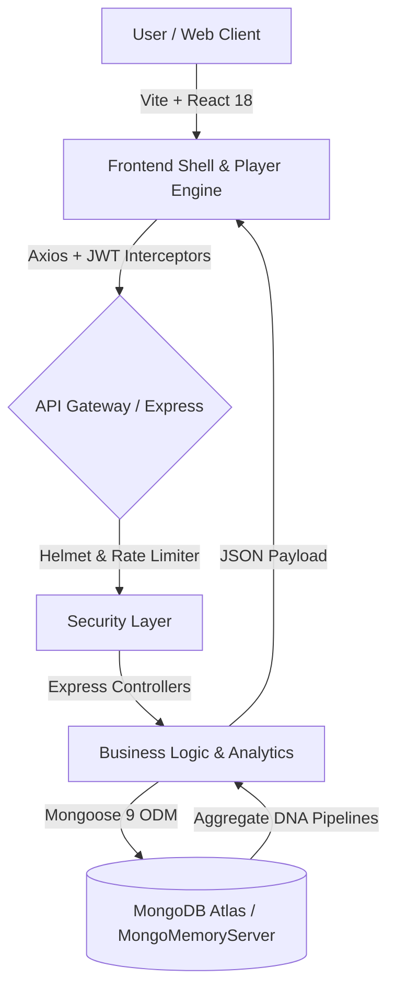

# 🎵 EchoBeats - Premium MERN Music Platform

EchoBeats is a modern, full-stack MERN music streaming application engineered for high-performance audio playback, procedural visualizer analytics, and intelligent mood discovery. Featuring a dark glassmorphism design system, real-time Mood DNA SVG radar charts, and listening time capsule memory generators, EchoBeats delivers a state-of-the-art Web Audio experience.


---

## 🔑 Demo Test Credentials

| Role | Email | Password | Access Rights |
| :--- | :--- | :--- | :--- |
| **Admin** | `admin@example.com` | `password123` | Full administrative access, track uploads, and analytics |
| **User (John)** | `john@example.com` | `password123` | Standard user library, liked songs, history & Mood DNA |
| **User (Jane)** | `jane@example.com` | `password123` | Standard user library, liked songs, history & Mood DNA |

---

## 🎨 System Architecture & Data Flow



---

## 🚀 Key Signature Features

| Feature | Description |
| :--- | :--- |
| **📻 EchoWave Player** | Persistent glassmorphism audio player with queue drawer, shuffle, repeat modes (0/1/2), and seek/volume controls. |
| **🎨 Canvas Visualizer** | 60 FPS procedural HTML5 Canvas visualizer synced to play state and track mood color gradients (100% CORS-safe). |
| **🧬 Mood DNA Analytics** | Real-time SVG Radar chart plotting listening habits across 7 moods, computing peak hours, top artists, and personality badges. |
| **⏳ Listening Time Capsule** | Generate past date-range memory playlists (Last 7 Days, 30 Days, All Time) with one-click "Save as Playlist". |
| **🎛️ Interactive Equalizer** | Audio EQ selector (`Flat`, `Bass Boost`, `Vocal Clarity`, `Club`, `Acoustic`) with animated frequency bars. |
| **⌨️ Keyboard Shortcuts** | Hotkey support (`Space` to play/pause, `Shift+Right/Left` to skip tracks, `?` for hotkey drawer). |
| **❤️ Liked Songs & History** | Optimistic like toggling (`useLiked` hook) and day-grouped activity history with listened duration badges. |

---

## 🛡️ Security & Resilient Architecture

- **Mongoose 9 Async Hooks**: Rewrote `pre('save')` hooks to return Promises without callback parameters, preventing double-hashing or runtime crashes.
- **HTTP Security & CORS**: Integrated `helmet` security headers and dynamic CORS origin allow-lists.
- **Rate Limiting**: Enforced `authLimiter` (20 req / 15 min on `/login` & `/register`) and global `apiLimiter` (300 req / min).
- **Multi-Tier DB Fallback**: Automatic connection fallback chain (`Atlas SRV` $\rightarrow$ `Direct Atlas Cluster Nodes` $\rightarrow$ `Local MongoDB` $\rightarrow$ `MongoMemoryServer` zero-config local fallback).

---

## 📡 API Reference Endpoint Overview

### 🔐 Authentication & Profile Routes
- `POST /api/users/register` - Create user account (Rate limited)
- `POST /api/users/login` - Authenticate user & receive JWT token (Rate limited)
- `GET /api/users/profile` - Fetch authenticated user profile
- `GET /api/users/likes` - Fetch user liked songs collection
- `GET /api/users/history` - Fetch paginated listening history logs
- `GET /api/users/analytics/dna` - Calculate Mood DNA radar metrics & personality badge
- `GET /api/users/timecapsule?from&to` - Query historical tracks for date range memory capsule

### 🎵 Song & Playlist Routes
- `GET /api/songs` - Fetch songs (Supports `?mood=` and multi-field search `?q=`)
- `POST /api/songs/:id/like` - Toggle like status for track
- `POST /api/songs/:id/play` - Log playback duration event
- `GET /api/playlists` - Fetch user playlists
- `POST /api/playlists` - Create new custom playlist
- `PUT /api/playlists/:id` - Add/remove tracks from playlist
- `DELETE /api/playlists/:id` - Delete custom playlist

---

## 🛠️ Tech Stack

- **Frontend**: React 18, Vite 7, Tailwind CSS, Lucide Icons, Framer Motion, Axios, React-Toastify.
- **Backend**: Node.js, Express 5, Mongoose 9, Helmet, Express-Rate-Limit, BcryptJS, JSONWebToken.
- **Testing & Verification**: Jest, Supertest, MongoMemoryServer.
- **Deployment**: Vercel Monorepo (`vercel.json` serverless rewrite configuration).

---

## 📋 Local Installation & Quick Start

### 1. Clone & Install Dependencies
```bash
git clone https://github.com/Vedant7924/EchoBeats-WebApp.git
cd EchoBeats-WebApp
npm run install-all
```

### 2. Environment Configuration
Create a `.env` file in the `backend/` directory:
```env
PORT=5000
MONGO_URI=your_mongodb_atlas_connection_string
JWT_SECRET=your_jwt_secret_key_here
NODE_ENV=development
```

### 3. Seed Database
```bash
npm run seed
```

### 4. Start Development Servers
```bash
npm run dev
```
Open [http://localhost:5173](http://localhost:5173) in your browser!

---

## 🧪 Running Automated Tests

```bash
cd backend
npm test
```

---

*Created with passion by [Vedant7924](https://github.com/Vedant7924)*